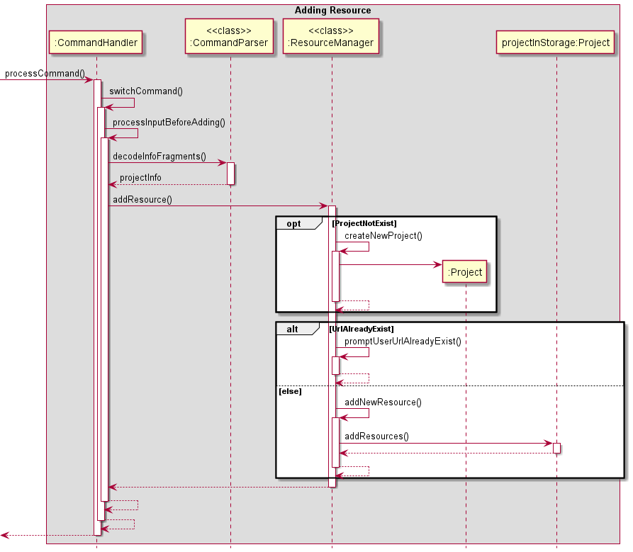
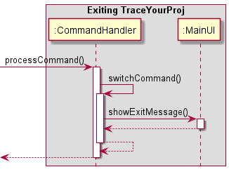
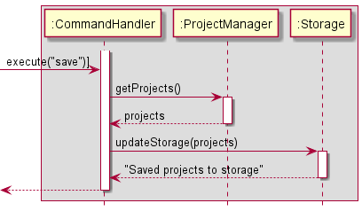
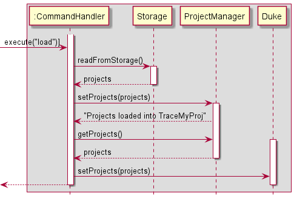

# TraceYourProj's Developer Guide

## Design & implementation
{Describe the design and implementation of the product. Use UML diagrams and short code snippets where applicable.}

### Design
{insert design}

### Implementation
This section describes some noteworthy details on how certain features are implemented.

### Add projects and resources
**Proposed Implementation**

Given below is an example usage scenario and how the add mechanism behaves at each step.

**Step 1**:
The user launches the application. The project list of the application will be initialized as an empty list.

**Step 2**:
The user executes the following commands in order to add a resources to a project.

>add p/CS2113 url/www.traceyourproj.com d/Project Website

The following sequence diagram shows how the add operation works:

> The arrow pointing from :CommandHandler to :Project should be pointed at the middle of :project. However, due to 
> limitation of PlantUML, the arrow is pointed at the left-hand corner of :Project.

> projectInStorage:Project represents a project that is already existing in the project list of the program.

**Design Consideration**

Aspect: How add executes
* Alternative 1 (current choice):
  * The add feature will do a loop through all the projects in the ArrayList projects to see if the project has already
    existed. For each project, it will loop through all the resources to see if a resource with the same URL has already
    existed.
    
    > If the project does not exist in the ArrayList:
    >   * Create a new project and append the resource into its resource list.
    
    > If the project does exist:
    > * If resource with the same URL exists:
    >   * Prompt the user that the resource with the same URL has already existed
        in the project's resource list.
    > * If resource with the same URL does not exist:
    >   * Append the new resource into the project resource list.

* Alternative 2 (none)
---
### List all projects & their respective resources feature
**Proposed Implementation**  

Given below is an example usage scenario and how the list-all mechanism behaves at each step.  

**Step 1**:
The user launches the application for the first time. The application’s initialised database will be empty at the start.

**Step 2**:
The user executes the following command in order to add a certain project’s resources.  

>add p/CS2113 url/www.traceyourproj.com  

>add p/CS3223 url/www.kaggle.com

**Step 3**:
The user wishes to see the list of resources for all projects. He executes the following command to see them.  

>list-all

**Design Consideration**  

Aspect: How list-all executes
* Alternative 1 (current choice):
  * This list-all feature will do a loop through all the projects in the projects arraylist. For each project, it will loop through all the resources and print it out.
* Alternative 2 (none)

The following sequence diagram shows how the list-all operation works:

### List all the resources for a particular project feature
**Proposed Implementation**  

Given below is an example usage scenario and how the list-all mechanism behaves at each step.  

**Step 1**:
The user launches the application for the first time. The application’s initialised database will be empty at the start.

**Step 2**:
The user executes the following command in order to add a certain project’s resources.
> add p/IT3011 url/www.apple.com  

> add p/CZ2003 url/www.google.com  

**Step 3**:
The user wishes to see the list of resources for one project, CZ2003. He executes the following command to see them.  

>list *CZ2003*

**Design Consideration**  

Aspect: How list PROJECTNAME executes  
* Alternative 1 (current choice):
    * This feature will do a check to see if the project exists first. If it exists, it will do a loop through all the resources for this project and print it out.
    * **Pros**: When there is an error, we will know if the error is due to the fact that the project does not exist.
* Alternative 2:
    * Print the project’s resources straight away without checking if project exists.  
    * **Cons**: Harder to pinpoint the cause of the error if an error is thrown.

The following sequence diagram shows how the list PROJECTNAME operation works:

### Deleting resource from a specified project 
**Proposed Implementation**

Given below is an example usage scenario and how deleting resource(s) works.

**Step 1**:
The user launches the application. The application state is initialised by the Storage class which reads the text file.

**Step 2**:
The user executes the following command to delete the 2nd resource in the resource list of the project 'CS2113'.
>delete p/CS2113 i/2

**Step 3**:
If PROJECT_NAME is not found in the database, the application prompts the user that the project is not found. 
  If INDEX is invalid <i>(i.e. negative integer or exceeds the number of resources in that project)</i>, the application prompts the user to reenter a valid index.
  Else, the system feedbacks to the user that the specified resource has been successfully deleted.

**Step 4**:
The user can execute `list p/CS2113` to verify that the specified resource has been deleted from the project.

The following sequence diagram shows how the delete operation works:

### Editing resource from a specified project
**Proposed Implementation**

Given below is an example usage scenario and how editing a resource works.

**Step 1**:
The user launches the application. The application state is initialised by the Storage class which reads the text file.

**Step 2**:
The user executes the following command to edit the url and link description of the 3nd resource in the resource list of the project 'CS2113'.
>edit p/CS2113 i/2 url/www.CS2113tp.com d/This is tp site.

**Step 3**:
If PROJECT_NAME is not found in the database, the application prompts the user that the project is not found.
  If INDEX is invalid <i>(i.e. negative integer or exceeds the number of resources in that project)</i>, the application prompts the user to reenter a valid index.
  Else, the system feedbacks to the user that the specified resource has been successfully edited.

**Step 4**:
The user can execute `list p/CS2113` to verify that the specified resource has been successfully edited.

### Finding resource(s) in a project or all projects based on a keyword
**Proposed Implementation**

Given below is an example usage scenario and how the find mechanism behaves at each step.

**Step 1**:
The user initialises the application and adds the resources, Project and Resource objects are created accordingly.

**Step 2**:
The user wants to find resources that match a keyword website in his project CS2113. 
He executes the following command to print out a list of resources in CS2113 that match the input keyword.
> find k/website p/CS2113

**Step 3**:
If the project name cannot be found, the user will be prompted to search for a valid project name.
If the project name is not given, such as in the following command, all projects will be searched to find resources matching the keyword. 
> find k/website

The following sequence diagram shows how the find operation works:

**Design Consideration**

Aspect: How find executes
* Alternative 1 (current choice):
  * Allow the user to input find k/KEYWORD p/PROJECTNAME or find k/KEYWORD 
    based on whether he wants to find relevant resources in a single project or all projects.
  * **Pros**: Fewer commands for the user to choose between. Simple to implement.
* Alternative 2:
  * Allow the user to input 2 separate commands find p/PROJECTNAME k/KEYWORD and find-all k/KEYWORD 
    based on whether he wants to find relevant resources in a single project or all projects.
  * **Pros**: Simple to implement.
  * **Cons**: More functions and code required.

### Exiting TraceYourProj
**Proposed Implementation**

Given below is an example usage scenario and how the exit mechanism behaves at each step.

**Step 1**:
The user initialises the application and adds the resources, Project and Resource objects are created accordingly.

**Step 2**:
The user has finished using the application and wishes to exit the application. He executes the following command to leave the application. 
> exit

The following sequence diagram shows how the exit operation works:

**Design Consideration**

Aspect: How exit executes
* Alternative 1 (current choice):
  * Break out of do-while loop in the main function in Duke when boolean condition isLoop 
    is no longer true.
  * **Pros**: Easy to implement.
  * **Cons**: Possibility of entering an infinite loop if not properly coded.
* Alternative 2:
  * Execute System.Exit(0) when exit is executed.
  * **Pros**: Easy to implement.
  * **Cons**: Reduces testability since more code is required to throw an exception when System.exit is 
    called and catch that exception, so the JUnit test does not fail.

## Saving and loading data

**Proposed Implementation**

Given below is an example usage of how the saving and loading functionality works.

**Step 1:**
The user initialises the application and adds the resources, Project and Resource objects are created accordingly.

**Step 2:**
The user issues the save command by typing “save”

**Step 3:**
The Project and Resource objects contents are saved to a text file upon exiting the program

**Step 4:**
The application state can be restored by the Storage class which can read the text file and creates the objects 
to create an application state when the program starts by issuing the load command by typing “load”

The following sequence diagram shows how the **save** operation works:

The following sequence diagram shows how the **load** operation works:

**Design Consideration**

* Alternative 1: 
  * Save upon exit, load upon startup.  

  * **Pros:** Easier to implement, program will not have performance issues as it is done at exit.
  * **Cons:** Changes may be lost if the program exits in an unexpected way.

* Alternative 2: 
  * Save and load only if command is issued. (Current choice)
  * **Pros:** Easy to implement, user has freedom of choice whether to save and load.
  * **Cons:** User may not be aware of the functionality without referring to the user guide.

## Product scope
### Target user profile

{Describe the target user profile}

### Value proposition

{Describe the value proposition: what problem does it solve?}

## User Stories

|Version| As a ... | I want to ... | So that I can ...|
|--------|----------|---------------|------------------|
|v1.0|new user|see usage instructions|refer to them when I forget how to use the application|
|v1.0|user|exit TraceYourProj when I finish managing my resources|leave TraceYourProj|
|v1.0|user|see the list of resources for all my projects|recall what are all the projects and resources in the database of TraceYourProj 
|v2.0|user|find a to-do item by name|locate a to-do without having to go through the entire list|
|v2.0|user|find resources I have that are related to a keyword I specify|easily find resources I need without going through each project and resources
|v2.0|user|see the list of resources for one of my project|recall what are the resources of one particular project in the database of TraceYourProj
## Non-Functional Requirements

{Give non-functional requirements}

## Glossary

* *glossary item* - Definition

## Instructions for manual testing

{Give instructions on how to do a manual product testing e.g., how to load sample data to be used for testing}
